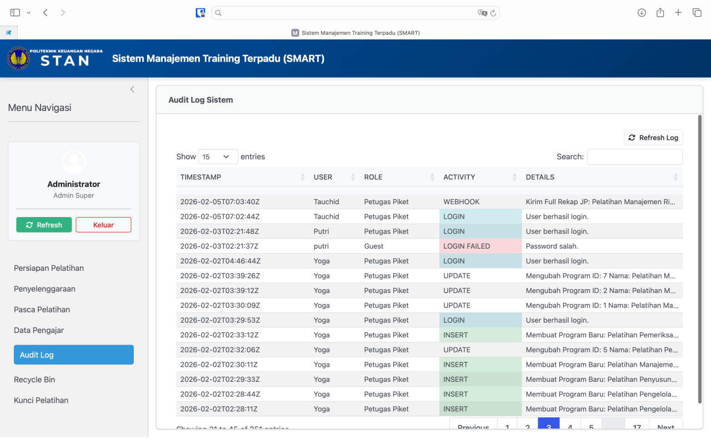
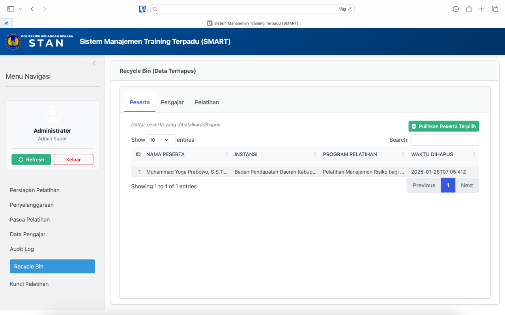
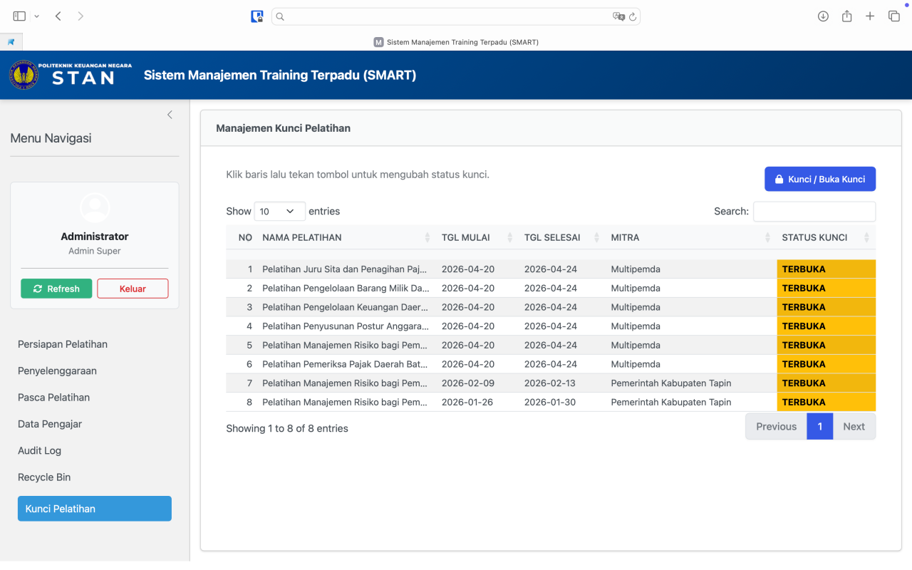

# Modul Khusus Administrator

::: callout-important
Menu ini hanya akan muncul di bilah sisi (*sidebar*) jika Anda memiliki hak akses dan *login* sebagai **Admin Super** atau **Administrator**.
:::

## Audit Log

Fitur keamanan untuk melacak seluruh jejak aktivitas pengguna di dalam sistem SMART. Sistem secara otomatis mencatat *timestamp* (stempel waktu), nama *user*, peran, tipe aktivitas (seperti login, menambah data, atau menghapus data), dan detail aktivitasnya.

{#fig-audit-log fig-align="center" width="100%"}

## Recycle Bin (Tempat Sampah)

{#fig-recycle-bin fig-align="center" width="100%"}

-   Berfungsi sebagai tempat penampungan sementara untuk data yang telah dihapus (*Soft Delete*) oleh pengguna.
-   Data yang dihapus tidak langsung hilang permanen dari *database*, melainkan masuk ke menu ini.
-   Anda dapat meninjau data Peserta, Pengajar, atau Pelatihan yang dihapus.
-   **Cara Memulihkan:** Pilih baris data yang ingin dikembalikan, lalu klik tombol **Pulihkan** (ikon *trash-restore*). Data tersebut akan kembali muncul di sistem aktif.

## Manajemen Kunci Pelatihan

{#fig-kunci-pelatihan fig-align="center" width="100%"}

-   Digunakan untuk mengunci (*Lock*) program pelatihan yang pelaksanaannya sudah benar-benar *Selesai*.
-   Klik pada salah satu baris pelatihan, lalu tekan tombol **Kunci / Buka Kunci**.
-   Program yang dikunci akan memunculkan ikon gembok merah.
-   **Fungsi Kunci:** Mencegah pengguna biasa menambah, mengedit, atau menghapus data peserta, jadwal, dan absensi pada program tersebut demi menjaga integritas data riwayat diklat.
