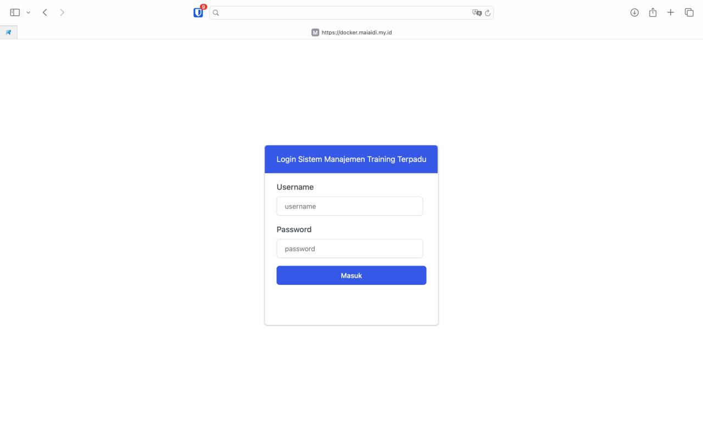

# Akses Sistem dan Navigasi Dasar {.unnumbered}

**Sistem Manajemen Training Terpadu (SMART)** adalah sistem informasi berbasis web untuk mengelola seluruh siklus pelatihan, mulai dari tahap persiapan hingga pasca-pelatihan.

## Memulai Penggunaan

{#fig-login-screen fig-align="center" width="100%"}

-   **Login:** Buka halaman utama aplikasi SMART. Masukkan *Username* dan *Password* yang telah diberikan. Akses menu yang muncul akan disesuaikan dengan peran Anda (Petugas Piket atau Administrator).
-   **Navigasi:** Gunakan menu di bilah sisi (*sidebar*) sebelah kiri untuk berpindah antar modul aplikasi.
-   **Profil Pengguna:** Di bagian atas *sidebar*, terdapat informasi nama dan peran Anda saat ini.
-   **Tombol Aksi Cepat:**
-   **Refresh:** Berguna untuk menyinkronkan data di layar Anda dengan pembaruan terbaru dari pengguna/komputer lain.
-   **Keluar:** Mengakhiri sesi Anda (*Logout*) secara aman.

## Tips Tampilan Data

-   Tabel pada sistem ini dirancang padat (*squeezed*) agar dapat menampilkan banyak data sekaligus.
-   **Melihat Teks Lengkap:** Jika ada teks yang terpotong di dalam tabel, cukup arahkan kursor (*hover*) ke sel tersebut untuk melihat teks selengkapnya.

::: callout-tip
Refresh akan dilakukan secara otomatis setiap 60 detik. Untuk berjaga-jaga, biasakan menggunakan tombol **Refresh** manual sebelum melakukan perubahan data penting untuk memastikan Anda mengedit versi data yang paling mutakhir.
:::
