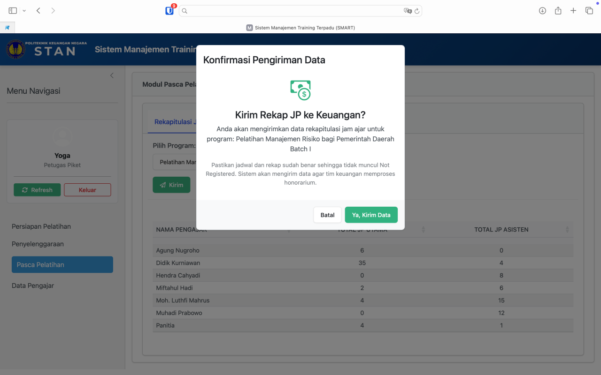
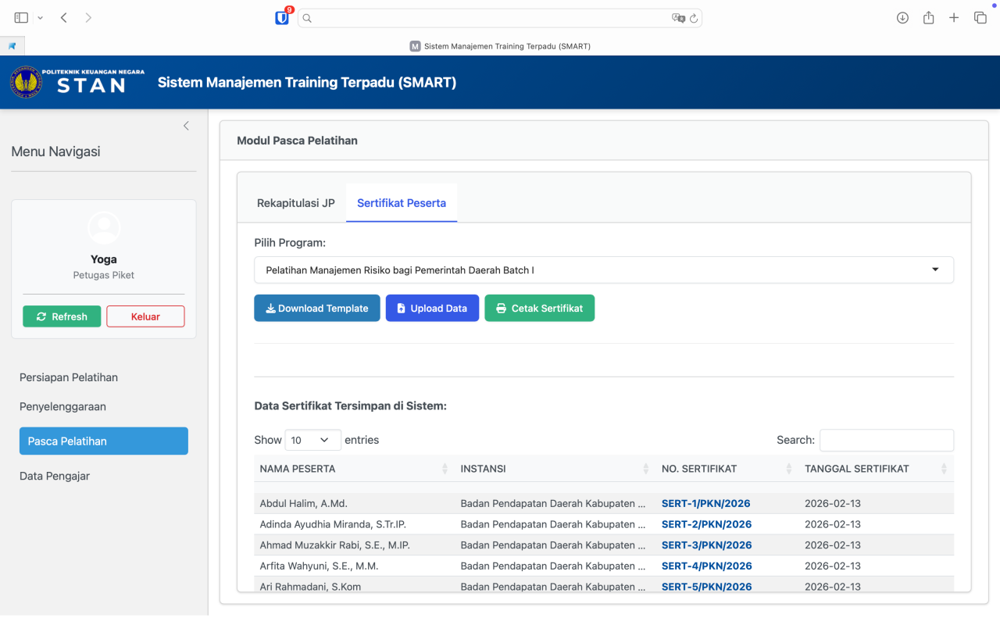

# Modul Pasca Pelatihan

Modul ini digunakan untuk menyelesaikan tahap administrasi dan pelaporan setelah pelatihan selesai.

## Rekapitulasi JP (Jam Pelajaran)

Sistem akan secara otomatis merekap dan menghitung total JP Utama serta JP Asisten untuk setiap pengajar, berdasarkan data jadwal yang telah diinput sebelumnya.

{#fig-rekap-jp fig-align="center" width="100%"}

-   **Kirim ke Keuangan:** Pastikan data jadwal sudah final dan benar. Klik tombol **Kirim** (ikon pesawat kertas hijau). Sistem akan mengirimkan rekapitulasi lengkap (termasuk nama pengajar, NIP, NIK, dan nomor rekening) langsung ke worksheet keuangan (tanpa pengisian form manual) untuk memproses pencairan honorarium.

## Sertifikat Peserta

Menu untuk mengelola penomoran dan pencetakan sertifikat tanda tamat pelatihan.

{#fig-sertifikat-peserta fig-align="center" width="100%"}

1.  Pilih program pelatihan pada menu *dropdown*.
2.  **Download Template:** Klik untuk mengunduh format CSV yang sudah berisi ID dan Nama Peserta dari program tersebut.
3.  **Isi Template:** Buka *file* CSV yang diunduh, lalu lengkapi kolom Nomor Sertifikat dan Tanggal Sertifikat yang diperoleh dari Sekretaris Direktur.
4.  **Upload Data:** Klik **Upload Data** dan masukkan *template* yang telah Anda lengkapi.
5.  **Cetak Sertifikat:** Klik tombol ini, dan sistem akan memproses *file* sertifikat, kemudian mengirimkan hasilnya ke alamat email pelatihan\@pknstan.ac.id untuk diunggah ke sistem Nadine.
